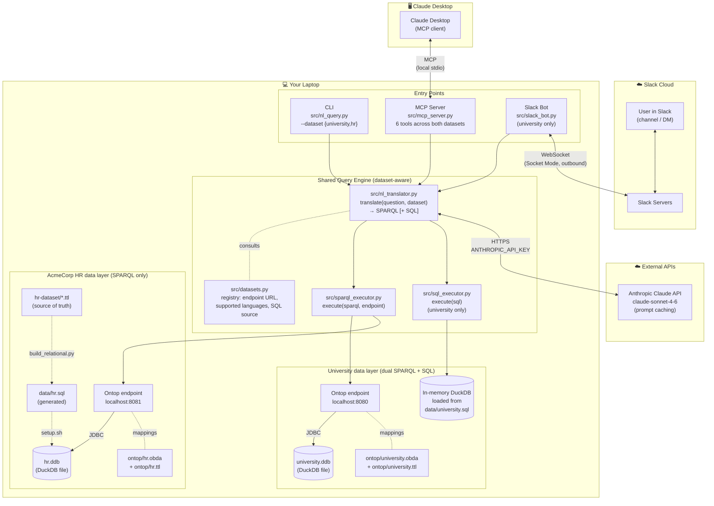
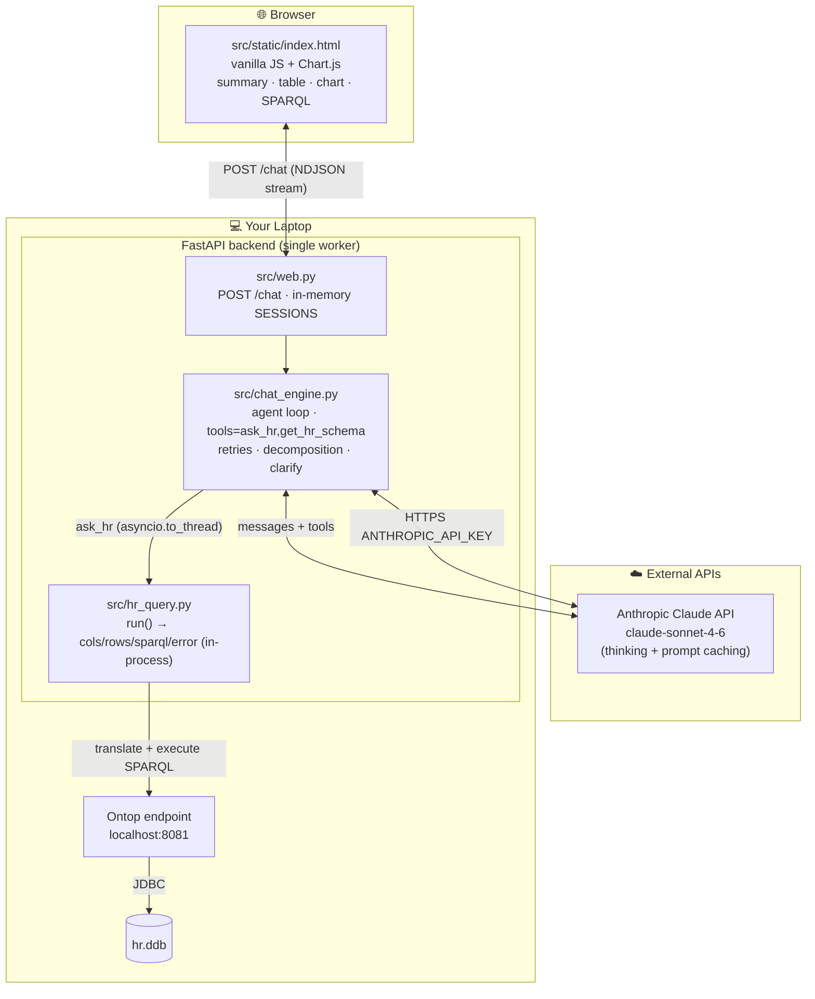

# Architecture

End-to-end picture of the system as it stands today: two datasets (university dual
SPARQL+SQL, HR SPARQL-only), entry points (CLI / MCP / Slack / HR Web Chat), one shared
query engine, two Ontop endpoints. The **HR Web Chat** is layered on top of the MCP
server (it is an MCP *client*) rather than calling the engine directly — see
"HR Web Chat" below.

## System Overview



Solid arrows are runtime data flow. Dotted edges are config / build-time
relationships (`build_relational.py` regenerates `data/hr.sql` from the HR Turtle;
`setup.sh` builds the `.ddb` files from the SQL).

---

## Two datasets, one engine

| | University | AcmeCorp HR |
|---|---|---|
| Ontop endpoint | `localhost:8080` | `localhost:8081` |
| DuckDB binary | `university.ddb` | `hr.ddb` |
| Source of truth | `data/university.sql` | `hr-dataset/*.ttl` (9 Turtle files) |
| Languages generated | SPARQL + SQL (parallel) | SPARQL only |
| Display | Side-by-side tables | Single table |
| Slack | Supported | Not exposed |
| MCP tools | `ask_university`, `run_sql`, `get_schema` | `ask_hr`, `run_sparql_hr`, `get_hr_schema` |

The two endpoints are independent processes (`./start_ontop.sh university` and
`./start_ontop.sh hr`) and can run in parallel. DuckDB takes an exclusive lock on
each `.ddb`, which is why `sql_executor.py` loads `data/university.sql` into an
**in-memory** DuckDB rather than opening `university.ddb` directly while Ontop
holds it.

---

## Connection Notes

| Connection | Direction | Protocol | Requires |
|---|---|---|---|
| Slack ↔ Bot | Bot opens outbound WebSocket to Slack | WSS (Socket Mode) | `SLACK_BOT_TOKEN` + `SLACK_APP_TOKEN` |
| Claude Desktop ↔ MCP server | Local IPC | stdio | Local only |
| HR Web Chat (`chat_engine.py`) → HR pipeline | In-process call (`hr_query.run` via `asyncio.to_thread`) | Python | Local only |
| Browser ↔ HR Web Chat | Local HTTP | `POST /chat` (NDJSON stream) | `uvicorn web:app` on `:8000` |
| Translator → Claude API | Outbound HTTPS | REST / JSON | `ANTHROPIC_API_KEY` |
| SPARQL executor → Ontop (university) | Local HTTP | HTTP POST | Ontop running on `:8080` |
| SPARQL executor → Ontop (HR) | Local HTTP | HTTP POST | Ontop running on `:8081` |
| Ontop → DuckDB | In-process JDBC | DuckDB JDBC driver | Heap ≥ 2g (`ONTOP_JAVA_ARGS` in `start_ontop.sh`) |
| SQL executor → in-memory DuckDB | In-process | Python library | `data/university.sql` (university only) |

If an Ontop endpoint isn't running, SPARQL queries against that dataset fail
with a helpful error. The university SQL path still works without Ontop (it
goes through the in-memory DuckDB, not the `.ddb` file).

---

## Sequence: question → answer

### University (dual SPARQL + SQL), e.g. via Slack

```
User (Slack)        Slack Servers       slack_bot.py            Engine
     │                   │                   │                     │
     │── "@Bot Q?" ─────►│                   │                     │
     │                   │── WS event ──────►│                     │
     │                   │                   │── translate(Q,      │
     │                   │                   │      "university") ►│── Claude API
     │                   │                   │                     │◄─ SPARQL + SQL
     │                   │                   │── execute() ───────►│── Ontop :8080
     │                   │                   │                     │   + in-mem DuckDB
     │                   │                   │◄── 2× DataFrames ───│
     │                   │◄── post_message ──│                     │
     │◄── reply ─────────│                   │                     │
```

`translate()` runs SPARQL and SQL generation **concurrently** on a
`ThreadPoolExecutor(max_workers=2)`; the executors then run both queries in
parallel as well.

### HR (SPARQL only), e.g. via CLI

```
User (terminal)     nl_query.py          Engine
     │                   │                   │
     │── ./query_hr.sh ──►│                   │
     │                   │── translate(Q,    │
     │                   │      "hr") ──────►│── Claude API
     │                   │                   │◄─ SPARQL
     │                   │── execute() ─────►│── Ontop :8081 → hr.ddb
     │                   │◄── DataFrame ─────│
     │◄── rich table ────│                   │
```

Only one branch runs (no SQL executor, no second thread). The output is a
single results table rather than the university's side-by-side comparison.

---

## HR Web Chat

A claude.ai-style conversational UI for the HR dataset. A backend Claude agent loop
orchestrates two tools, `ask_hr` / `get_hr_schema` (with extended thinking, retries,
decomposition, and clarifying questions). The tools run the HR pipeline **in-process**
(`src/hr_query.py`) — there is no MCP subprocess; `src/mcp_server.py` remains the MCP
surface for Claude Desktop. `ask_hr` returns structured rows directly, so the browser
renders tables and charts with no markdown round-trip.



`web.py` keeps one in-memory conversation per `session_id` — hence the **single-worker**
requirement. Only `ask_hr` / `get_hr_schema` are defined to the model (`chat_engine.HR_TOOLS`);
their handlers call `hr_query` directly rather than reaching the full MCP server.

### Sequence: one chat turn (streamed)

`stream_turn` is an async generator; `POST /chat` forwards each event as one NDJSON
line, so the browser updates **as the turn unfolds** rather than after it finishes.

```
Browser            web.py            chat_engine        hr_query          Ontop :8081
   │                  │                   │                  │                 │
   │─ POST /chat ────►│─ stream_turn() ──►│                  │                 │
   │◄─ session ───────│                   │─ messages.stream (thinking) ─► Claude API
   │◄─ thinking_delta… (reasoning streams live)              │                 │
   │                  │                   │◄─ tool_use × N (ask_hr …)            │
   │◄─ tool_start ────│   (UI: "Querying HR: …")             │                 │
   │                  │                   │─ run() (to_thread) ─►│─ translate+execute ─►│
   │                  │                   │◄─ card {cols/rows} ──│◄── DataFrame ─│
   │◄─ tool_result ───│   (table/chart card appears now)     │                 │
   │                  │                   │─ messages.stream (tool_result) ► Claude API
   │◄─ text_delta… (summary streams token-by-token)          │                 │
   │◄─ done ──────────│                   │                  │                 │
```

A compound question yields several `ask_hr` `tool_use` blocks (one per sub-question),
each streamed as its own `tool_result` card as it returns; the final `text_delta`
stream synthesizes them. A transient HR-endpoint failure is retried in `chat_engine`
before the error is handed back to the model; an ambiguous question streams a plain
clarifying question with no tool call (`done.needs_clarification = true`).
