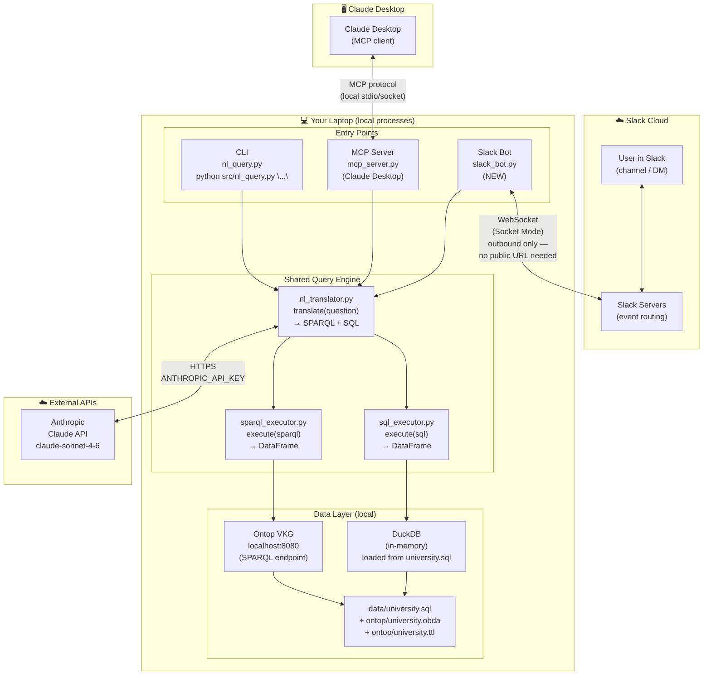

# Architecture Diagram

## System Overview



---

## Connection Notes

| Connection | Direction | Protocol | Requires |
|---|---|---|---|
| Slack ↔ Bot | Bot opens outbound WebSocket to Slack | WSS (WebSocket Secure) | `SLACK_BOT_TOKEN` + `SLACK_APP_TOKEN` |
| Bot → Claude API | Outbound HTTPS | REST/JSON | `ANTHROPIC_API_KEY` |
| CLI → Claude API | Outbound HTTPS | REST/JSON | `ANTHROPIC_API_KEY` |
| Claude Desktop → MCP | Local IPC | stdio / local socket | None (local only) |
| Engine → Ontop | Local HTTP | HTTP POST | Ontop running on :8080 |
| Engine → DuckDB | In-process | Python library | `data/university.sql` |

---

## What's New vs. What Exists

```
EXISTING (unchanged)              NEW (additive)
─────────────────────             ───────────────
src/nl_query.py      (CLI)        src/slack_bot.py
src/mcp_server.py    (MCP)        requirements.txt  (+slack_bolt)
src/nl_translator.py              .env               (+2 tokens)
src/sparql_executor.py
src/sql_executor.py
data/university.sql
ontop/university.*
```

The Slack bot is a **thin new entry point** that calls the same engine as the CLI and MCP server. No existing files are modified.

---

## Sequence: Slack Question → Answer

```
User (Slack)          Slack Servers         slack_bot.py           Engine
     │                     │                     │                    │
     │── "@Bot question" ──►│                     │                    │
     │                     │── WebSocket event ──►│                    │
     │                     │                     │── translate() ─────►│── Claude API
     │                     │                     │                    │◄─ SPARQL+SQL
     │                     │                     │── execute() ───────►│── Ontop / DuckDB
     │                     │                     │◄─ DataFrames ───────│
     │                     │◄── post_message() ──│                    │
     │◄── reply in thread ─│                     │                    │
```
